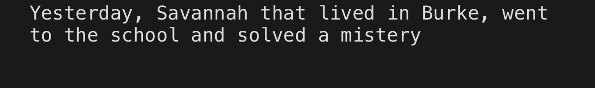

# RandomStoryGen2
 I imported the random module and created parts of the stories in different lists, then I only selected the parts of the lists at random to generate a random story.
 
The output will look like the example below

